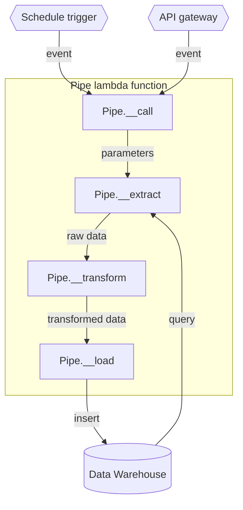

# Reporting pipeline

Collection of data ETL pipelines as lambda functions

## Architecture overview



## Prerequisites

- Python 3.12+
- [AWS SAM CLI](https://docs.aws.amazon.com/serverless-application-model/latest/developerguide/install-sam-cli.html)

## Local setup

Create a virtual environment for the project

```bash
# Create virtual env
python -m venv .venv
# Switch to venv
source .venv/bin/activate
# Install dependencies
pip install -r src/requirements.txt
# Load required static tables
python ./src/load_static.py
```

It is also strongly recommended to install the recommended VS Code extensions

## Run API locally

```bash
# 1. Build
sam build
# 2. Invoke locally
sam local invoke MyPipe
# 3. Run as an API endpoint
sam local start-api --env-vars scripts/local.json
```

Bear in mind that you need to rebuild anytime there's a code change (`start-api` supports hot reloading so doesn't need to be restarted every time)

```
TODO add curl example and postman collection
```

## Development guidelines

### Database configurations

Database connexions are configured the `CONNEXIONS` global variable from 'common.config'.
Each connexion is a instance of the `common.database.Connexion` dataclass.
Default values should be provided and should be the values for local development.

### Pipe definition

Each pipe should be a class inheriting from the `common.pipe.Pipe` base class.
That base class provides a lot of the boilerplate for extracting and loading the data as well as basic logging.
When writing a pipe, you'll mostly be overriding the static and/or abstract methods of the base class as detailed below.
See docstring for more details on how each method work.

#### Required methods

The following methods must be defined in each pipe

- `table`: table where transformed data will be loaded
- `extract`: query the data

#### Optional methods

- `schema`: define a schema for transformed data
- `indexes`: define indexes for transformed data
- `connexion`: define connexion for loading
- `loading_method`: define how to load the data in the output table
- `transform`: define how to transform the data

### Querying a database

It is important to use `with` clauses when querying the database to avoid leaving open connexions (for instance in `extract` or `load` methods)

```python
with MySQL(CONNEXIONS["connexion_name"]) as db:
    db.execute(text("""-- sql
            SELECT * FROM table_name
        """))
```

### Maintenance

To update dependencies, you can use [`pip-review`](https://github.com/jgonggrijp/pip-review): `pip-review --local --interactive`
